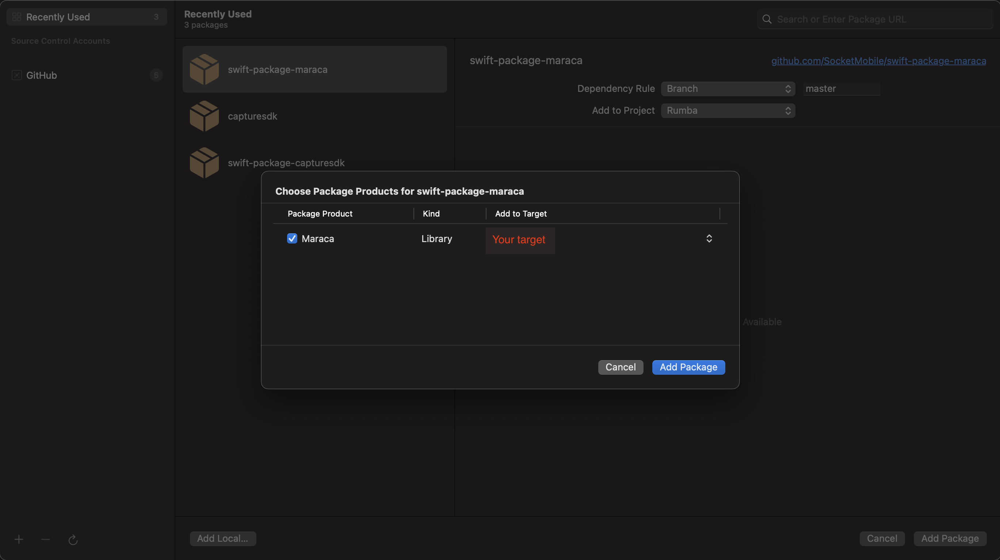
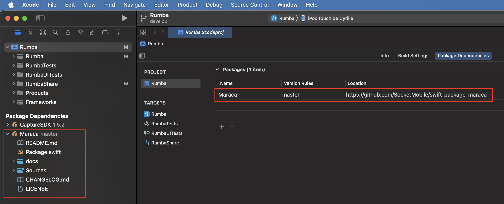

# Maraca Version 1.0.10 - Swift Package Manager

Socket Mobile is a leading innovator of data capture and delivery solutions for enhanced productivity.

Maraca establishes connections between your iOS application using our [iOS CaptureSDK](https://github.com/SocketMobile/swift-package-capturesdk) and a web application using our [CaptureJS SDK](https://docs.socketmobile.com/capturejs/en/latest/gettingStarted.html). This enables the web application to connect with our scanners and NFC readers with the same flexibilty that our iOS SDK provides.

# Devices compatibility and Maraca versions
|       Devices                                          |          < 1.0.7       |         >= 1.0.7       |        1.0.10         |
| :----------------------------------------------------: | :--------------------: | :--------------------: | :--------------------: |
|   **SocketCam C820**                                   |          ❌            |           ✅           |           ✅           |
|   **S720/D720/S820**                                   |          ❌            |           ❌           |           ✅           |
|   **D600, S550, and all other barcode scanners**       |          ✅            |           ✅           |           ✅           |
|   **S370**                                             |          ❌            |           ❌           |           ✅           |

# Table of Contents
* [Quick install notes](#quick-install-notes)
* [Usage](#usage)
* [Documentation](#documentation)
* [Example](#example)
* [License](#license)

# Quick install notes
Maraca is using [Swift Package Manager](https://www.swift.org/package-manager/).

First, you need to install Xcode.

To include the SDK in your Xcode project you have to add a `Package Dependency` in the project's settings section and in the tab "Package Dependencies".

Add the url of this repository: [https://github.com/SocketMobile/swift-package-maraca](https://github.com/SocketMobile/swift-package-maraca)



Once you have added the package, you should see `Maraca` added to your Package Dependencies in Xcode's Project Navigator as follow:



Note: this Maraca Swift Package has as a dependency our [CaptureSDK Swift Package](https://github.com/SocketMobile/swift-package-capturesdk), as it was with Cocoapods back then.

# Usage

Under the hood, Maraca is an umbrella for our iOS Capture SDK. So naturally, you need to provide credentials to get started. 

The most important step is to call `observeJavascriptMessageHandlers(_:)`
You may provide your own Javascript Message Handler names if you're familiar with [WKUserContentController](https://developer.apple.com/documentation/webkit/wkusercontentcontroller). Otherwise, this can be nil.
This function enables messages containing data to be transferred from your web application using CaptureJS to your iOS application.

Inside the completion handler of `beging(withAppKey:appId:developerId:completion:)`, create your `WKWebView` using the public `Maraca.shared.webViewConfiguration` configuration

```swift

override func viewDidLoad() {
    super.viewDidLoad()

    setupMaraca()
}

private func setupMaraca() {
    
    let appKey =        <Your App Key>
    let appId =         <Your App ID>
    let developerId =   <Your Developer ID>
    let bundle = Bundle.main
    
    Maraca.shared.injectCustomJavascript(mainBundle: bundle, javascriptFileNames: ["getInputForDecodedData"])
        .observeJavascriptMessageHandlers(YourOwnMessageHandlers.allCases.map { $0.rawValue })
        .setDelegate(to: self)
        .begin(withAppKey: appKey,
               appId: appId,
               developerId: developerId,
               completion: { [weak self] (result) in

                    if result == .E_NOERROR {
                        self?.setupUI()
                    } else {
                        // Encountered some error, inspect result
                    }
        })
}

// Initialize WKWebView with Maraca.shared.webViewConfiguration after
// setting up Maraca
private var webview: WKWebView!

private func setupUI() {

    webview = {
        let w = WKWebView(frame: .zero, configuration: Maraca.shared.webViewConfiguration)
        w.navigationDelegate = self
        return w
    }()
    
    view.addSubview(webview)
    
    // Set up constraints, etc..
    
    let myWebApplicationURLString = .....
    
    guard let url = URL(string: myWebApplicationURLString) else {
        return
    }
    
    loadMyWebApplication(with: url)
    
}

```

# Documentation

Full documentation can be found [here](https://docs.socketmobile.com/rumba/en/latest/maraca.html)

# Example

To run the example project, go to the Example directory first.

# License

Maraca is available under the MIT license. See the LICENSE file for more info.
